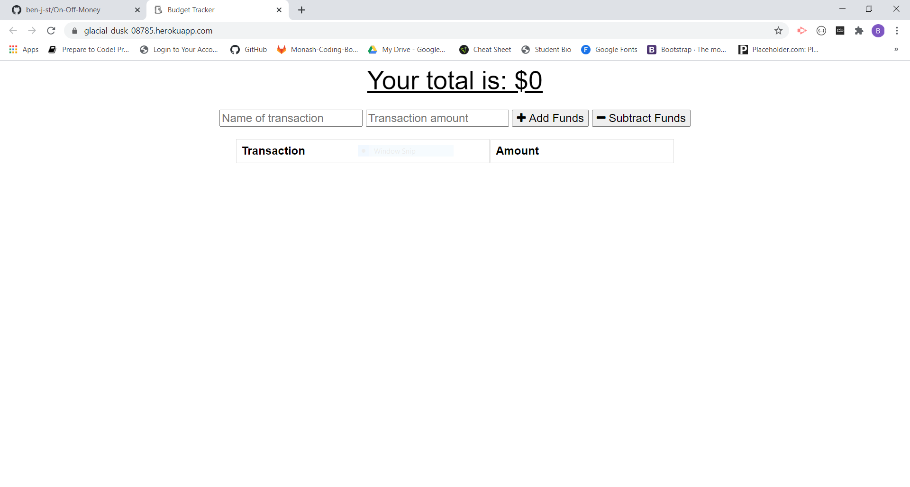

# On-Off-Money
   

## Description 

An application to help the user track their budget, it has offline support so even if the user doesnt have access to the internet or their connection drops out they can still keep accurate track of their budget

## Links

<a href="https://glacial-dusk-08785.herokuapp.com/">Live Heroku Version</a>

## Table of Contents

* [Description](#Description)
* [Installation](#Installation)
* [Usage](#Usage)
* [Licence](#Licence)
* [Contributing](#Contributing)
* [Tests](#Tests)
* [Questions](#Questions)
* [Screenshot](#Screenshot)
* [Walkthrough](#Walkthrough-video)

## Installation

step 1 - user will need to clone down the repo into a desired folder using: git clone 
    on this address https://github.com/ben-j-st/On-Off-Money

step 2 - user will need to use the code: npm i  
    to install all dependencies listed in the package.json file

step 3 - user can then run the file from terminal on there server.js file by using the code:
    npm run
    
step 4 - Application will be deployed on the local host 3000

## Usage

Keep track of finances, use to keep track of both incoming and outgoing money and help plan your budget better

## Licence 

MIT

A short and simple permissive license with conditions only requiring preservation of copyright and license notices. Licensed works, modifications, and larger works may be distributed under different terms and without source code. see full licence at https://choosealicense.com/licenses/mit/

## Contributing 

was built based on specifications from trilogy, lots of the front end code and javascript was provided by trilogy as well.

## Tests

none at this time

## Questions

Github Username: <a href="https://github.com/ben-j-st">ben-j-st</a>

Email: ben_j_stephens@hotmail.com

## Screenshot 

 